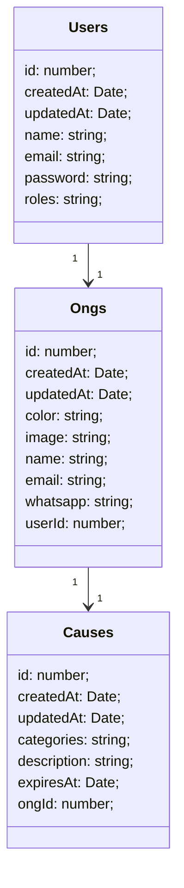

# Entidades

Abaixo, o diagrama das entidades que irão existir para suportar todos os dados exibidos no aplicativo.

> Se você não conseguir visualizar o diagrama, por favor, instale a seguinte extensão [clicando aqui.](https://github.com/BackMarket/github-mermaid-extension)

